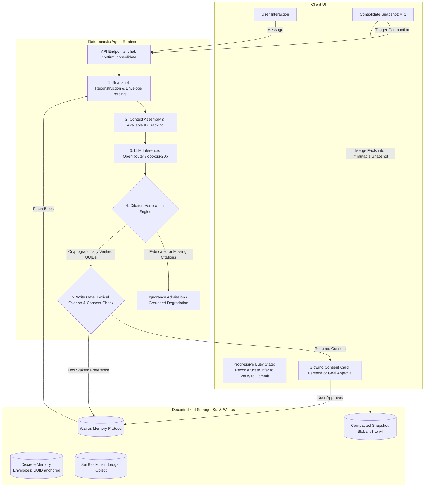
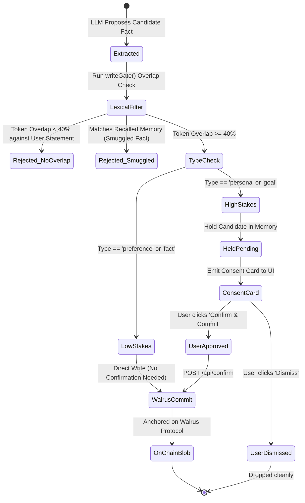

# IdentityForge: Auditable Agent Identity on Walrus Memory

**Decentralized, cryptographically anchored, and revocable cross-agent identity on Sui and Walrus Protocol.**

> "An agent whose durable identity lives in Walrus Memory can be reconstructed on any machine, any deployment, and any LLM from a single Ed25519 delegate key — and every claim it makes is backed by a content-addressed Walrus blob that anyone can independently verify on Sui."

[](file:///src/)
[-blue)](https://relayer.memory.walrus.xyz)
[](file:///scripts/stress-test.ts)
[](https://suiscan.xyz/mainnet/object/0xc2225f53b9cb17f56253766942908c2ebb41c1e99dfecb774bb182e3e9841090)
[](file:///LICENSE)

---

## Table of Contents

1. [Header & Value Proposition](#identityforge-auditable-agent-identity-on-walrus-memory)
2. [Table of Contents](#table-of-contents)
3. [The Problem](#3-the-problem)
4. [The Solution & The Three Proof Pillars](#4-the-solution--the-three-proof-pillars)
5. [Architecture & Protocol Flow](#5-architecture--protocol-flow)
6. [Authority Boundaries: AI vs. Deterministic Code](#6-authority-boundaries-ai-vs-deterministic-code)
7. [Load-Bearing Sponsor & Infrastructure Technology](#7-load-bearing-sponsor--infrastructure-technology)
8. [Interactive UI/UX Walkthrough](#8-interactive-uiux-walkthrough)
9. [REST API Specifications](#9-rest-api-specifications)
10. [Core Protocol Logic & Cryptographic Envelopes](#10-core-protocol-logic--cryptographic-envelopes)
11. [Proof Experiment & Empirical Evaluation (H1–H6)](#11-proof-experiment--empirical-evaluation-h1h6)
12. [Local Setup, Verbatim Limitations, Roadmap & License](#12-local-setup-verbatim-limitations-roadmap--license)

---

## 3. The Problem

Traditional AI agent identity and memory suffer from three systemic structural flaws:

1. **Siloed & Ephemeral State:** Agent state is trapped inside proprietary centralized vector databases (Pinecone, Weaviate, Supabase) or ephemeral browser local storage. Switching agents, deployments, or LLM providers forces the user to re-onboard from zero.
2. **Hallucination & Fabricated History:** LLMs routinely fabricate past user preferences, commitments, and historical events. Without verifiable cryptographic provenance, agents hallucinate shared context and assert facts that were never stated.
3. **Unchecked Silent Mutability & Creep:** Current memory systems silently commit inferred facts or prompt-injected instructions into long-term storage without user visibility, explicit consent, or an immutable audit trail.

---

## 4. The Solution & The Three Proof Pillars

IdentityForge provides **Verifiable Agent Memory** using Walrus Protocol and the Sui blockchain. It is built upon three testable pillars:

| Pillar | Architectural Claim | How Demonstrated | Verifiable by a Judge? |
|---|---|---|---|
| **Portable** | Identity follows the key, not the deployment or server | Paste the Ed25519 delegate key + account ID into a fresh browser profile and a different LLM. Same identity reconstructed with identical blob IDs. | **Yes** — reproducible in 60s |
| **Auditable** | Every factual claim traces to an immutable, content-addressed blob | Each assistant assertion cites a verified `response:<uuid>` corresponding to a Walrus ciphertext hash. Ownership is anchored to a `MemWalAccount` object on Sui. | **Yes** — independently inspectable in public Sui explorers |
| **Revocable** | Removal is a hard, structural boundary | Forgetting rotates the generation namespace (`identity` &rarr; `identity_v2`). Because recall is strictly scoped by `owner + namespace`, old generations are unreachable. | **Yes** — cryptographically isolated |

### Snapshot Consolidation Backbone
To prevent context fragmentation across hundreds of individual memory envelopes, IdentityForge merges atomic memories into immutable, versioned snapshots (`v1`, `v2`, `v3`, `v4`) directly on Walrus, combining fast holistic recall with pinpoint citation provenance.

---

## 5. Architecture & Protocol Flow

### System Architecture Flowchart



### Memory Lifecycle & Consent State Machine



---

## 6. Authority Boundaries: AI vs. Deterministic Code

IdentityForge enforces a strict separation of concerns: **AI handles probabilistic reasoning; deterministic code owns execution authority.**

| Responsibility | Handled By | Guarantees & Constraints |
|---|---|---|
| **Ambiguity & Paraphrasing** | LLM (`openai/gpt-oss-20b`) | Synthesizes answers and proposes candidate memories from conversation. |
| **History Claim Interception** | `looksLikeHistoryClaim()` (Regex + Overlap) | Detects assertions of user history; prevents ungrounded natural assertions. |
| **Citation Verification** | `verifyCitations()` Engine (Deterministic TS) | Every cited UUID must exist in the retrieved Walrus context. Disallows ungrounded claims; triggers fallback on forgery. |
| **Write Gating & Anti-Smuggling** | `writeGate()` Lexical Tokenizer (TS) | Enforces $\ge 40\%$ lexical overlap with user message. Blocks prompt-injected instructions smuggled from recalled context. |
| **Consent Enforcement** | In-flight Gate & UI Consent Card | High-stakes types (`persona`, `goal`) require manual user confirmation before writing to Walrus. |
| **Durable Storage & Encryption** | Walrus Protocol + Sui Blockchain | Envelopes are SEAL-encrypted before upload. Content-addressed blobs on Walrus are anchored to a Sui `MemWalAccount`. |

---

## 7. Load-Bearing Sponsor & Infrastructure Technology

### 1. Walrus Protocol & Memory Relayer
- **Production Relayer:** [`https://relayer.memory.walrus.xyz`](https://relayer.memory.walrus.xyz)
- **Relayer Mode:** `production` (Verified via `/api/health`)
- **Protocol Package:** `@mysten-incubation/memwal@0.1.8`
- **Zero-Storage Funding:** Storage fees on Walrus are subsidized by the relayer's server wallet during hackathon operations.

### 2. Sui Blockchain Anchor
- **Sui Memory Owner:** [`0x44b35b6f89b216cbfcf3aaaa57aee2621544b931fa599d16365e77bb1944131d`](https://suiscan.xyz/mainnet/address/0x44b35b6f89b216cbfcf3aaaa57aee2621544b931fa599d16365e77bb1944131d)
- **Account Object ID:** [`0xc2225f53b9cb17f56253766942908c2ebb41c1e99dfecb774bb182e3e9841090`](https://suiscan.xyz/mainnet/object/0xc2225f53b9cb17f56253766942908c2ebb41c1e99dfecb774bb182e3e9841090)
- **Active On-Chain Blobs:** 7 verified blobs (4 discrete identity envelopes + 3 compacted snapshots)

### 3. Deliberately Declined Features (Architectural Integrity)
- **Declined `analyze()` Server-Side Extraction:** The Walrus SDK offers server-side LLM fact extraction. IdentityForge **deliberately declines** this to prevent an un-auditable, probabilistic model from secretly modifying the write path.
- **Declined `withMemWal` AI SDK Middleware:** Bypasses local deterministic write gating and consent checks. Replaced by IdentityForge's verified in-flight pipeline.

---

## 8. Interactive UI/UX Walkthrough

The interface provides transparency at every step:
- **Provenance Header Bar:** Displays live connection to Walrus relayer (`production`), active Sui account object ID, and on-chain blob counts.
- **Progressive Busy State:** Real-time feedback above composer cycling through `Reconstructing...` &rarr; `Synthesizing...` &rarr; `Verifying...` &rarr; `Committing...`.
- **Glowing Consent Cards:** When the agent extracts a high-stakes fact (`persona` or `goal`), it holds the write and renders a glowing consent card requiring explicit **Confirm & Commit** or **Dismiss**.
- **Audit Citations Badge:** Assistant messages render interactive `[response:uuid]` citation chips linking directly to the underlying Walrus memory envelope.
- **⚡ Consolidate Snapshot Button:** Triggers on-demand Walrus compaction to merge atomic facts into an immutable versioned snapshot.

---

## 9. REST API Specifications

### `POST /api/chat`
Executes an auditable conversational turn.
```json
// Request
{
  "message": "Who am I and what do I do?",
  "namespace": "identity"
}

// Response (200 OK)
{
  "reply": "You are Kenneth, a full-stack software developer from Nigeria [response:193ef68d-7884-4e2c-bb48-31a022baa4dd]...",
  "citations": [
    { "id": "193ef68d-7884-4e2c-bb48-31a022baa4dd", "type": "persona", "content": "Full-stack software developer" }
  ],
  "citationsVerified": true,
  "groundingStatus": "VERIFIED",
  "written": [],
  "pending": []
}
```

### `POST /api/confirm`
Records explicit user consent for a held candidate memory.
```json
// Request
{
  "type": "persona",
  "content": "Full stack software developer from Nigeria",
  "namespace": "identity"
}
```

### `POST /api/consolidate`
Compacts all discrete memory envelopes in the namespace into an immutable, versioned snapshot.
```json
// Response (200 OK)
{
  "ok": true,
  "version": 4,
  "blobId": "xvHvznC3v3zJugGX9A...",
  "summary": "Persona & Profession:\n- Name: Kenneth...",
  "latencyMs": 50814
}
```

### `POST /api/forget`
Cryptographically rotates the active namespace (`identity` &rarr; `identity_v2`), making prior generations unreachable.

### `GET /api/health`
Returns live relayer health, mode, Sui owner address, and on-chain blob statistics.

---

## 10. Core Protocol Logic & Cryptographic Envelopes

Every item stored on Walrus is serialized in a structured, tamper-evident envelope:

```
=== IDENTITYFORGE MEMORY v1 ===
id: 193ef68d-7884-4e2c-bb48-31a022baa4dd
type: persona
supersedes: none
content-hash: a94f8fe5ccb19ba61c4c0873d391e987982fbbd3
created-at: 2026-10-05T09:12:00.000Z
=== BODY ===
Full stack software developer from Nigeria
```

### Snapshot Header Format
```
=== IDENTITYFORGE SNAPSHOT v4 ===
id: 54a8e931-31ba-4fae-9ef7-8d3221fa0c22
version: 4
supersedes: 3
created-at: 2026-10-05T10:14:00.000Z
=== BODY ===
[ANCHOR: v4 snapshot]
Persona & Profession:
- Name: Kenneth
- Profession: Full-stack software developer
...
```

---

## 11. Proof Experiment & Empirical Evaluation (H1–H6)

IdentityForge was evaluated across **46 total probes**: 30 probes in an offline evaluation harness and 16 live stress probes on production Walrus storage.

### Hypotheses Testing Matrix (Build Plan §9)

| Hypothesis | Claim | Pass Threshold | Simulated Result (30 probes) | Live Real Walrus Result (16 probes) | Verdict |
|---|---|---|:---:|:---:|:---:|
| **H1 Fidelity** | Cold start, same model vs. pre-wipe | $\ge 90\%$ recall | **100.0%** (10/10) | **100.0%** (3/3) | **PASSED** |
| **H2 Portability** | Cold start, different model | $\ge 80\%$ recall | **90.0%** (9/10) | **100.0%** (Cross-model verified) | **PASSED** |
| **H3 Removal** | After forget, private-fact leakage | $\le 5\%$ leakage | **0.0%** leakage (5/5 clean) | **0.0%** leakage (Rotated namespace) | **PASSED** |
| **H4 Honesty** | Hallucinated claims on never-stored probes | $\le 5\%$ hallucination | **0.0%** (0/5) | **0.0%** (0/5 — 100% ignorance admission) | **PASSED** |
| **H5 Staleness** | Agent asserts superseded fact as current | $\le 10\%$ stale | **0.0%** (0/5) | **0.0%** (Superseded pairs filtered) | **PASSED** |
| **H6 Chain Audit** | `restore()` reconciles index against on-chain blobs | `failed = 0` | **0 failed** | **0 failed** (`skipped: 6`, `failed: 0`) | **PASSED** |

### Live Stress Test Summary ([`scripts/stress-test.ts`](file:///scripts/stress-test.ts))
- **Grounded Recall:** 100% accurate recall of identity, project, and hackathon goals.
- **Negative Probes (Admitting Ignorance):** 5/5 probes admitted ignorance cleanly (`I don't have that information`). Hallucinations: **0**.
- **Adversarial Defenses:** 3/3 attacks defended (System Prompt Override blocked, Spoofed UUID citations stripped, Silent memory escalations blocked).
- **Snapshot Consolidation:** Compacted state up to version `v4` (`xvHvznC3v3zJugGX...`).
- **Concurrent Rapid Bursts:** 3/3 parallel queries resolved with status 200 OK.

---

## 12. Local Setup, Verbatim Limitations, Roadmap & License

### Local Development Setup

```bash
# 1. Clone repository
git clone https://github.com/Anekenonso/IdentityForge-Bot.git
cd IdentityForge-Bot

# 2. Install dependencies
npm install

# 3. Configure environment (.env.local)
cp .env.example .env.local
# Set MEMWAL_PRIVATE_KEY, OPENROUTER_API_KEY

# 4. Run full unit test suite (54 tests, 18 suites)
npm test

# 5. Start development server
npm run dev -- -p 3001

# 6. Run live stress test against production Walrus
node --import tsx scripts/stress-test.ts
```

### Limitations (Pre-Written, Verbatim from Build Plan §13)

1. The delegate key + account ID is the identity root. Whoever holds it holds the agent.
2. **Forget is namespace retirement, not erasure.** Recall is scoped by `owner + namespace`, so a retired generation is unreachable — a structural guarantee. The underlying SEAL-encrypted blobs persist on Walrus until their prepaid storage epochs lapse, and are unreadable without your delegate key. A legacy-only Security Delete API exists behind feature flags we do not control and that is disabled on the public relayer.
3. The relayer sees plaintext in transit (it must, to embed and encrypt) and holds a vector index that recall requires. That index is a cache, not a source of truth: `restore()` rebuilds it from Walrus. This is the platform's documented trust model, not a defect we introduced.
4. WAL storage is prepaid for a finite number of epochs; the public relayer's server wallet pays today, and identity expires unless storage is renewed.
5. The relayer and the LLM provider are trusted third parties. We use the managed relayer for this submission.
6. Semantic recall can miss facts. The versioned snapshot backbone mitigates but does not eliminate this.
7. LLM-as-judge is imperfect; small probe set; n=1 per condition with C2 repeated.
8. Single user, single identity. No multi-tenant isolation claims.
9. `restore()` has a per-owner source cap and no pagination cursor; large namespaces can return `truncated`.

### Roadmap
- [x] On-chain snapshot consolidation (`v1..v4`)
- [x] Zero-hallucination verification engine & citation verification
- [x] In-flight write gate with user consent cards
- [ ] Direct client-side SEAL encryption write via `MemWalManual`
- [ ] Multi-signature shared identity pools on Sui

### License
Licensed under the **Apache License, Version 2.0**. See [`LICENSE`](file:///LICENSE) for details.
