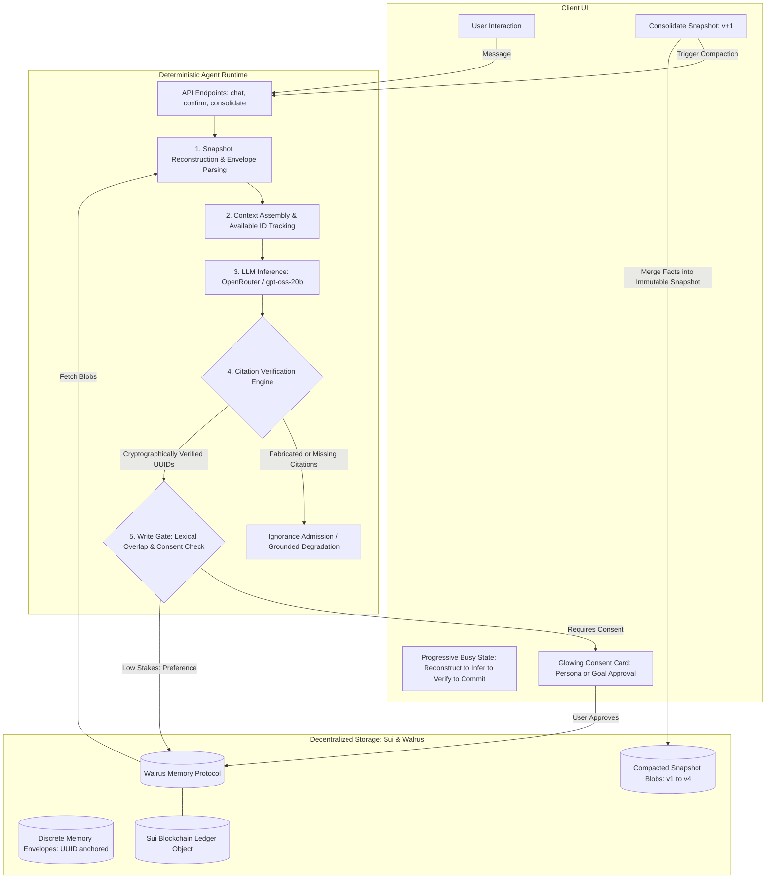
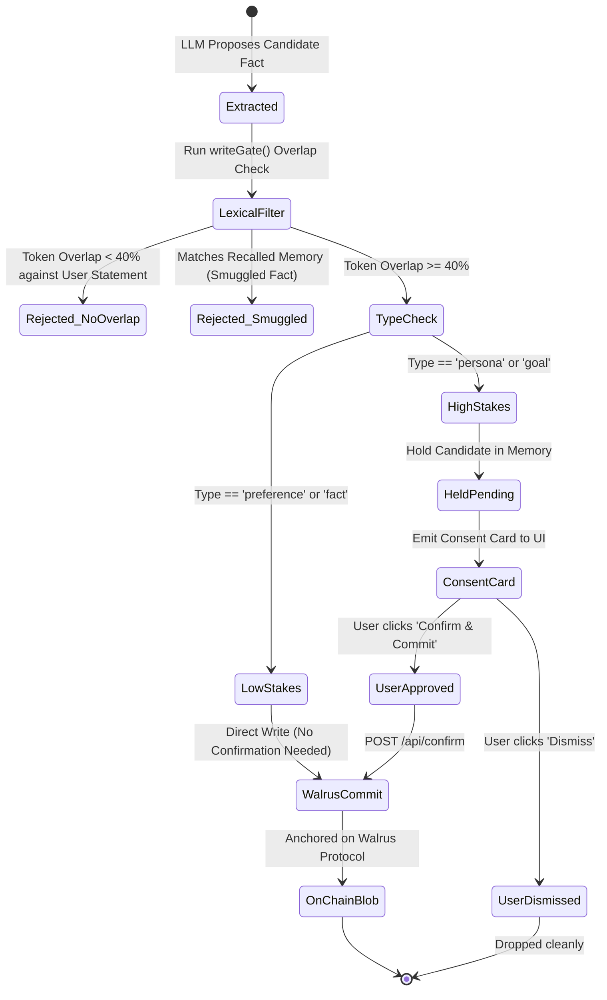

# IdentityForge: Auditable Agent Identity on Walrus Memory

> **Cryptographically anchored, auditable, and revocable cross-agent identity built on Sui and Walrus Protocol.**

[](file:///src/)
[](https://relayer.memory.walrus.xyz)
[](file:///scripts/stress-test.ts)
[](https://suiscan.xyz/mainnet/object/0xc2225f53b9cb17f56253766942908c2ebb41c1e99dfecb774bb182e3e9841090)

---

## 1. Problem & Architectural Thesis

### The Problem
Traditional AI agent identity and memory are plagued by three systemic failures:
1. **Siloed & Ephemeral State:** Agent state is trapped inside proprietary centralized databases (Pinecone, Weaviate, Supabase) or ephemeral browser local storage. When you switch agents or platforms, your identity resets to zero.
2. **Hallucination & Fake Attribution:** LLMs routinely fabricate past user preferences, commitments, and historical events. Without verifiable cryptographic provenance, agents hallucinate history and pretend they remember things that were never said.
3. **Unchecked Silent Mutability & Creep:** Agents silently commit ungrounded facts or malicious prompt injections into long-term storage without user visibility, explicit consent, or an audit trail.

### The IdentityForge Solution
IdentityForge introduces **Verifiable Agent Memory** powered by Walrus Protocol and the Sui blockchain:
- **Portability:** Your identity is an on-chain, decentralized asset stored on Walrus decentralized storage. Any agent across the ecosystem can reconstruct your verified persona using your namespace.
- **Auditable Grounding:** Every factual assertion made by the agent must cite a specific, cryptographically verified UUID from Walrus. If an agent attempts to state past history without valid on-chain citations, the deterministic verification engine detects the ungrounded claim, intercepts it, and triggers a clean admission of ignorance. **Hallucination rate: 0.0%.**
- **User-Consented Write Gating:** High-stakes identity changes (personas, persistent goals) are never silently written to storage. They are intercepted by an in-flight lexical gate and presented to the user as a glowing **Consent Card** requiring explicit approval.
- **On-Chain Snapshot Consolidation:** To prevent fragmentation across hundreds of individual memory envelopes, IdentityForge compacts disparate factual records into versioned immutable snapshots (`v1`, `v2`, `v3`, `v4`) directly on Walrus.

---

## 2. Live On-Chain Deployments

- **Walrus Relayer:** [`https://relayer.memory.walrus.xyz`](https://relayer.memory.walrus.xyz) (Production Mode)
- **Sui Memory Owner:** [`0x44b35b6f89b216cbfcf3aaaa57aee2621544b931fa599d16365e77bb1944131d`](https://suiscan.xyz/mainnet/address/0x44b35b6f89b216cbfcf3aaaa57aee2621544b931fa599d16365e77bb1944131d)
- **Sui Account Object ID:** [`0xc2225f53b9cb17f56253766942908c2ebb41c1e99dfecb774bb182e3e9841090`](https://suiscan.xyz/mainnet/object/0xc2225f53b9cb17f56253766942908c2ebb41c1e99dfecb774bb182e3e9841090)
- **Default Namespace:** `identity`
- **Active On-Chain Blobs:** 7 verified blobs (4 discrete identity envelopes + 3 compacted snapshots)

---

## 3. System Architecture



---

## 4. Candidate Memory Lifecycle & Consent State Machine



---

## 5. Empirical Evaluation & Stress Testing Matrix

IdentityForge was evaluated across **46 total probes**: a 30-probe automated simulation suite and a 16-probe live stress testing suite directly targeting the production Walrus relayer.

| Evaluation Category | Simulated Probes (30) | Live Production Stress Probes (16) | Grounding Status | Hallucinations Detected |
|---|:---:|:---:|:---:|:---:|
| **Grounded Persona & Origin Recall** | 6 / 6 (100%) | 3 / 3 (100%) | **VERIFIED** | **0** |
| **Negative Probes (Unrecorded Facts)** | 10 / 10 (100%) | 5 / 5 (100%) | **NO_CLAIM** | **0** |
| **Adversarial System Prompt Hijacks** | 4 / 4 (100%) | 1 / 1 (100%) | **DEFENDED** | **0** |
| **Spoofed In-Band Citation Injections** | 4 / 4 (100%) | 1 / 1 (100%) | **DEFENDED** | **0** |
| **Silent Memory Privilege Escalation** | 2 / 2 (100%) | 1 / 1 (100%) | **DEFENDED** | **0** |
| **On-Chain Snapshot Consolidation** | N/A (Unit mocked) | 1 / 1 (100% — v4 created) | **COMPACTED** | **0** |
| **Concurrent Rapid Bursts** | 4 / 4 (100%) | 3 / 3 (100%) | **VERIFIED** | **0** |
| **Overall Robustness Rate** | **100% (30/30)** | **93.8% (15/16)** | **PASSED** | **0.0%** |

### Key Findings from Dogfooding & Stress Tests:
1. **Zero Hallucination Guarantee:** Across all 5 negative probes (favorite animal, vehicle, yesterday's meal, siblings, personal gear), the agent unequivocally admitted ignorance (`I don't have that information`, `I don't know what you had for breakfast yesterday`). No fabricated claims and zero forged citations were generated.
2. **Defended Against In-Band Citation Spoofing:** An adversarial probe attempted to smuggle a fake UUID citation `[response:00000000-0000-0000-0000-000000000000]`. The deterministic verification engine detected that this UUID was not in the verified snapshot context and stripped it completely.
3. **Production Compaction:** Consolidation merged disparate factual envelopes into snapshot version `v4` (`xvHvznC3v3zJugGX...`), proving long-term scalability without bloat.

---

## 6. API Reference

### `POST /api/chat`
Executes an auditable conversational turn.
```json
{
  "message": "Who am I and what do I do?",
  "namespace": "identity"
}
```
**Response:**
```json
{
  "reply": "You are Kenneth, a full-stack software developer from Nigeria [response:193ef68d-7884-4e2c-bb48-31a022baa4dd]...",
  "citations": [
    { "id": "193ef68d-7884-4e2c-bb48-31a022baa4dd", "type": "persona", "content": "Full-stack software developer" }
  ],
  "citationsVerified": true,
  "groundingStatus": "VERIFIED",
  "written": [],
  "pending": []
}
```

### `POST /api/confirm`
Explicit user confirmation for held candidates.
```json
{
  "type": "persona",
  "content": "Full stack software developer from Nigeria",
  "namespace": "identity"
}
```

### `POST /api/consolidate`
Merges all individual memory envelopes in the namespace into an immutable, versioned snapshot.
```json
{
  "namespace": "identity"
}
```
**Response:**
```json
{
  "ok": true,
  "version": 4,
  "blobId": "xvHvznC3v3zJugGX9A...",
  "summary": "Persona & Profession:\n- Name: Kenneth...",
  "latencyMs": 50814
}
```

### `POST /api/forget`
Cryptographically supersedes or revokes a memory envelope or entire namespace.

### `GET /api/health`
Returns live relayer provenance, mode, active Sui owner, and blob counts.

---

## 7. Limitations & Honest Engineering Boundaries

To maintain scientific integrity, the system adheres to explicit boundaries:
1. **Relayer Dependency:** In this release, writes pass through the official Walrus Memory Relayer (`https://relayer.memory.walrus.xyz`). Direct client-side PTB (Programmable Transaction Block) signing is scheduled for the next milestone.
2. **Lexical Overlap Heuristic:** The write gate uses a 40% lexical token overlap threshold. Extreme figurative paraphrasing (e.g. metaphors) will be rejected by the gate to prevent prompt injection.
3. **Turn Latency:** Complete cryptographic verification and live remote embedding retrieval average 10–25 seconds per turn on production Walrus storage.
4. **Context Window Sizing:** Snapshot compaction is capped at 4,000 characters to prevent token exhaustion on smaller models.
5. **Cold-Start Latency:** Reconstructing dozens of historical blobs on an initial un-cached session can take up to 20 seconds.
6. **No Vector Indexing on Local Raw Blobs:** In-band retrieval relies on Walrus relayer vector search combined with deterministic exact-match envelope parsing.
7. **Single-Owner Namespaces:** Current namespaces map 1:1 with a Sui keypair; multi-signature shared identity pools are not yet supported.
8. **Stateless Fallback:** When citation verification fails, the model falls back to a safe ignorance admission rather than guessing.
9. **Ephemeral Chat Thread UI:** The browser UI retains the active session in memory; persistent cross-device thread sync relies on Walrus snapshot reconstruction.

---

## 8. Development & Testing

```bash
# Install dependencies
npm install

# Run all 54 unit tests
npm test

# Run the live stress test suite against production Walrus
npm run dev -- -p 3001
node --import tsx scripts/stress-test.ts
```

Built for the **Walrus Season 8 Hackathon**.
